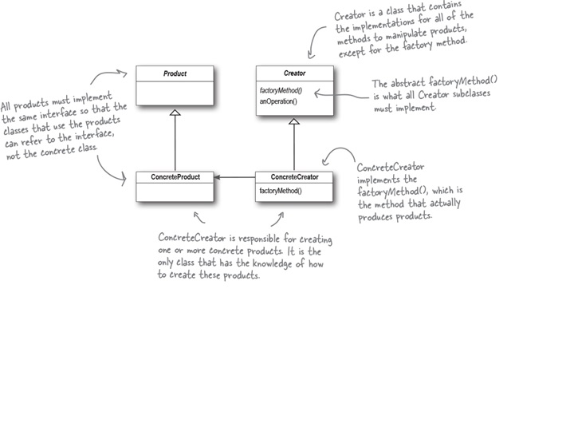
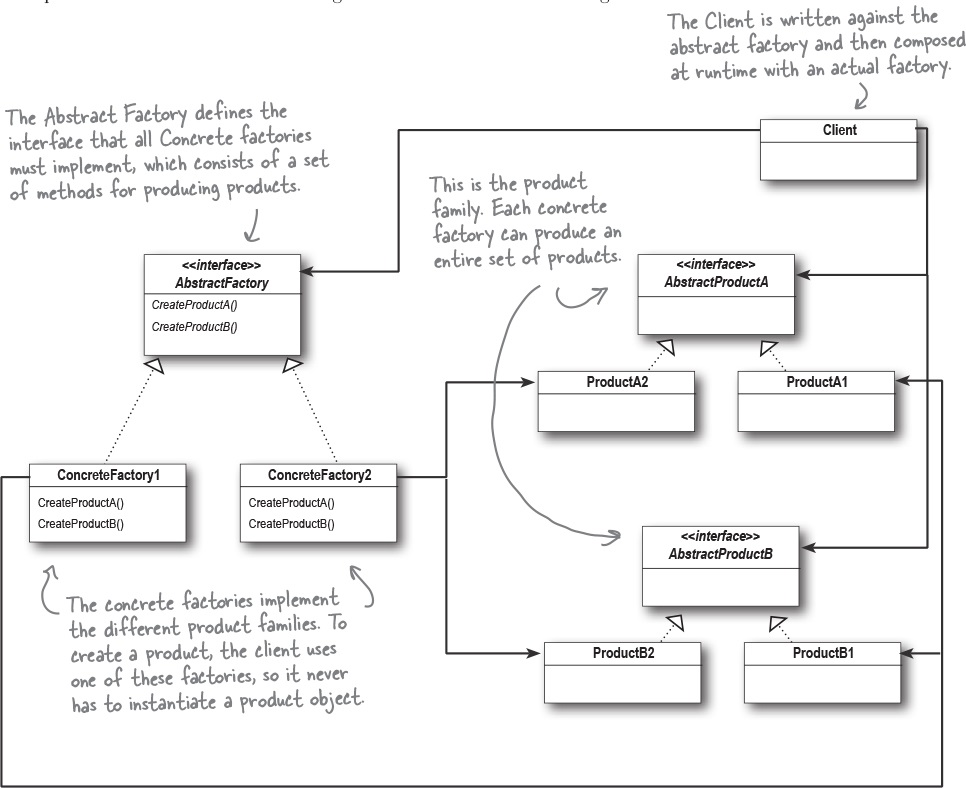

# DesignPatterns
**Factory Pattern**

## What is Factory Pattern and how does it work?
The Factory Method Pattern defines an interface for creating an object, but lets subclasses decide which class to instantiate. Factory Method lets a class defer instantiation to subclasses. It gives us a way to encapsulate the instantiations of concrete types. This decouples the client code in the superclass from the object creation code in the subclass.

`abstract Product factoryMethod(String type)`

Factory Method is not the only technique for adhering to the Dependency Inversion Principle, but it is one of the more powerful ones. The Factory Pattern makes sure that our high-level components do not depend on our low-level components; rather, they both depend on abstractions.



## What is Abstract Factory and how does it work?
An Abstract Factory gives us an interface for creating a family of products. By writing code that uses this interface, we decouple our code from the actual factory that creates the products. That allows us to implement a variety of factories that produce products meant for different contexts - such as different regions, different operating systems, or different look and feels. Because our code is decoupled from the actual products, we can substitute different factories to get different behaviors.



## When to use Factory Pattern and Abstract Factory?
Use Factory Pattern when:
- We need to decouple the client code from the concrete classes we need to instantiate;
- If we don't know ahead of time all the concrete classes we are going to need;
- A class we write is likely to change, we have some good techniques like Factory Method to encapsulate that change.

Use Abstract Factory whenever there families of products we need to create and we want to make sure our clients create products that belong together.

## How the code works?

This code implements the Factory Method design pattern to parse configuration files in different formats.

* The Client class reads the content of configuration files from the file system and uses the appropriate factory to create a parser for the file format. The file format is determined based on the file extension.

* The ConfigParser interface defines the method for parsing configuration content. The ConfigParserFactory interface is a factory interface for creating instances of ConfigParser.

* There are four classes that implement the ConfigParserFactory interface, each for a different file format: JsonConfigParserFactory, XmlConfigParserFactory, YamlConfigParserFactory, and PropertiesConfigParserFactory. Each factory creates an instance of a parser for its respective file format: JsonConfigParser, XmlConfigParser, YamlConfigParser, and PropertiesConfigParser.

  Each parser class implements the ConfigParser interface and provides the pseudocode to parse its respective configuration content.

The Client class has a main method that reads the content of the configuration files, determines the appropriate parser factory based on the file extension of the configuration file, creates an instance of the parser using the factory, and parses the configuration content using the parser. The program outputs the parsed content to the console.

*Note that this is pseudocode, and some functions of the code may just use the printout to assume complete the logic of the code.*

## How to run the code?(Programmatic Example)
``` Java
/**
   * Reads the content of the configuration files from the file system and parses them using the
   * appropriate parser factory.
   *
   * @param args the command-line arguments (not used).
   * @throws IOException if an I/O error occurs while reading the configuration files.
   */
  public static void main(String[] args) throws IOException {
    List<String> configFilesPath = new ArrayList<>();
    configFilesPath.add("config/application.properties");
    configFilesPath.add("config/config.yml");
    configFilesPath.add("config/config.json");
    configFilesPath.add("config/config.xml");

    for (String configPath : configFilesPath) {
      String configContent = Files.readString(Path.of(configPath));
      ConfigParserFactory factory = determineFactory(configPath);
      ConfigParser parser = factory.createParser();
      parser.parse(configContent);
    }
  }
```
> The main method is the entry point of the program, and it reads the content of the configuration files from the file system and parses them using the appropriate parser factory. It first creates a list of file paths for the configuration files, then iterates over the list, reads the content of each file, and creates the appropriate parser factory for the file format based on its file extension. It then creates a parser using the factory and calls the parse method of the parser to parse the configuration file content.

``` Java
/**
   * Determines the appropriate parser factory based on the file extension of the configuration
   * file.
   *
   * @param configFilePath the path of the configuration file.
   * @return the parser factory for the file format.
   * @throws IllegalArgumentException if the file format is not recognized.
   */
  private static ConfigParserFactory determineFactory(String configFilePath) {
    String fileExtension = getFileExtension(configFilePath);
    switch (fileExtension) {
      case ".json":
        return new JsonConfigParserFactory();
      case ".xml":
        return new XmlConfigParserFactory();
      case ".yaml":
      case ".yml":
        return new YamlConfigParserFactory();
      case ".properties":
        return new PropertiesConfigParserFactory();
      default:
        throw new IllegalArgumentException("Unknown config file format");
    }
  }
```
> The determineFactory method is a private method that takes a file path as input and returns the appropriate parser factory based on the file extension. It uses a switch statement to determine which factory to return based on the file extension. If the file format is not recognized, it throws an exception.

``` Java
/**
   * Returns the file extension of the given file name.
   *
   * @param filename the name of the file.
   * @return the file extension (including the dot).
   * @throws IllegalArgumentException if the file name has no extension.
   */
  private static String getFileExtension(String filename) {
    int index = filename.lastIndexOf(".");
    if (index == -1) {
      throw new IllegalArgumentException("No file extension found in " + filename);
    }
    return filename.substring(index);
  }
```
> The getFileExtension method is a private utility method that extracts the file extension from a file name. It takes a String parameter filename which is the name of the file. This method is not directly related to the factory method pattern. However, it is used in the determineFactory method to determine the appropriate parser factory based on the file extension of the configuration file.

## Program output:
```
Parse properties config content:
# ===============================
# = DATA SOURCE
# ===============================
# Set here configurations for the database connection
# Connection url for the database "netgloo_blog"
spring.datasource.url = jdbc:mysql://localhost:3306/netgloo_blog?useSSL=false
# Username and password
spring.datasource.username = root
spring.datasource.password = root
# Keep the connection alive if idle for a long time (needed in production)
spring.datasource.testWhileIdle = true
spring.datasource.validationQuery = SELECT 1

Parse yaml config content:
# my global config
global:
  scrape_interval:     15s
  evaluation_interval: 30s
  # scrape_timeout is set to the global default (10s).
  external_labels:
    monitor: codelab
    foo:     bar
rule_files:
  - "first.rules"
  - "my/*.rules"
remote_write:
  - url: http://remote1/push
    write_relabel_configs:
      - source_labels: [__name__]
        regex:         expensive.*
        action:        drop
  - url: http://remote2/push

Parse json config content:
{
  "listener": [{
    "tcp": {
      "address": "127.0.0.1:443"
    }
  }],
  "cluster_cipher_suites": "TLS_ECDHE_RSA_WITH_AES_128_GCM_SHA256,TLS_ECDHE_ECDSA_WITH_AES_128_CBC_SHA",
  "storage": {
    "consul": {
      "foo": "bar",
      "disable_clustering": "true"
    }
  },
  "telemetry": {
    "statsite_address": "baz"
  },
  "max_lease_ttl": "10h",
  "default_lease_ttl": "10h",
  "cluster_name":"testcluster",
  "ui":true
}

Parse xml config content:
<?xml version="1.0" encoding="UTF-8"?>
<project version="4">
  <component name="ProjectModuleManager">
    <modules>
      <module fileurl="file://$PROJECT_DIR$/.idea/DesignPatterns.iml" filepath="$PROJECT_DIR$/.idea/DesignPatterns.iml" />
    </modules>
  </component>
</project>
```

## UML
![diagram]exported_from_idea.jpg
## Credits
* Head First Design Patterns: A Brain-Friendly Guide
* Dive into Design Patterns
